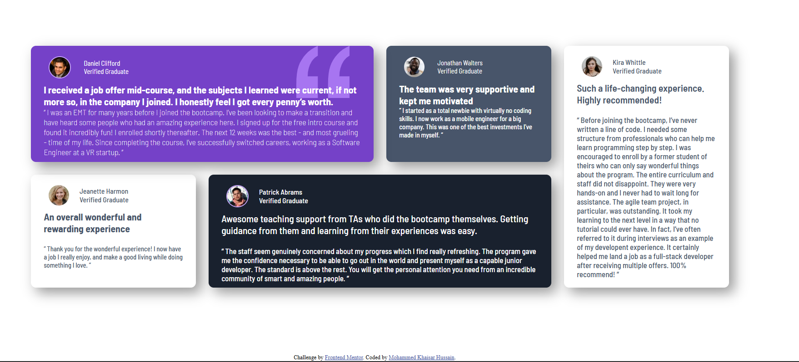

# Frontend Mentor - Testimonials Grid Section Solution

This is my solution to the [Testimonials Grid Section challenge on Frontend Mentor](https://www.frontendmentor.io/challenges/testimonials-grid-section-Nnw6J7Un7).  
Frontend Mentor challenges help you improve your front-end skills by building real-world projects using HTML, CSS, and modern best practices.

---

## 🧭 Table of Contents

- [Overview](#overview)
  - [The Challenge](#the-challenge)
  - [Screenshot](#screenshot)
  - [Links](#links)
- [My Process](#my-process)
  - [Built With](#built-with)
  - [What I Learned](#what-i-learned)
  - [Continued Development](#continued-development)
  - [Useful Resources](#useful-resources)
- [Author](#author)
- [Acknowledgments](#acknowledgments)

---

## 📖 Overview

### 🎯 The Challenge

Users should be able to:

- View the optimal layout for the site depending on their device's screen size
- See a clean, modern testimonial grid with visually distinct cards
- Experience consistent typography and spacing using `rem` units

### 🖼️ Screenshot

![Project Preview]

---

### 🔗 Links

- **Live Site URL:** ("https://khaisar-tech.github.io/Testimonials-grid-section/" target="_blank"))

---

## 🛠️ My Process

### 🧩 Built With

- Semantic **HTML5** markup  
- **CSS Custom Properties** (variables for colors & fonts)  
- **CSS Grid** for main layout structure  
- **Flexbox** for internal card alignment  
- **Responsive Design** using media queries  
- **Typography in `rem` and `clamp()`** for scalability and accessibility  
- **Box-shadow** and **border-radius** for modern styling  

---

### 💡 What I Learned

This project strengthened my understanding of **CSS Grid** and **responsive design principles**.  
I also learned how to scale typography and spacing using `rem` units instead of `px`,  
and how to combine `clamp()` for fluid font sizing.

Here’s a snippet of how I implemented fluid typography and consistent spacing:

```css
h2 {
  font-size: clamp(1rem, 2vw, 1.2rem);
}

.items {
  padding: 0.625rem 1.5625rem; /* 10px 25px in rem */
  border-radius: 0.625rem; /* 10px */
  box-shadow: 0.625rem 0.625rem 1.5625rem rgba(0, 0, 0, 0.4);
}
````

The biggest challenge was **arranging the cards** into the correct grid layout:

```css
.container {
  display: grid;
  grid-template-columns: repeat(4, 1fr);
  grid-template-areas:
    "first first second third"
    "fourth fifth fifth third";
  gap: 1.5625rem;
}
```

This helped me understand how `grid-template-areas` can make complex layouts much easier to visualize and maintain.

---

### 🔄 Continued Development

In future projects, I’d like to:

* Make the layout more dynamic using `auto-fit` and `minmax()` for true responsive behavior.
* Add light/dark theme support using CSS variables.
* Improve accessibility further with `aria` attributes and color contrast testing.

---

### 📚 Useful Resources

* [CSS Grid Layout Guide – MDN](https://developer.mozilla.org/en-US/docs/Web/CSS/CSS_Grid_Layout) – Helped me understand grid-template-areas.
* [Kevin Powell’s CSS Grid Course](https://www.youtube.com/watch?v=rg7Fvvl3taU) – Excellent walkthrough on modern layout building.
* [CSS Units Explained – freeCodeCamp](https://www.freecodecamp.org/news/css-unit-guide/) – Helped me properly switch from px to rem.

---

## 👨‍💻 Author

* **Website:** [Mohammed Khaisar Hussain](https://www.linkedin.com/in/mohammed-khaisar-hussain-3538952a4/)
* **Frontend Mentor:** [@MohammedKhaisar](https://www.frontendmentor.io/profile/MohammedKhaisar)
* **GitHub:** [@Khaisar-tech](https://github.com/Khaisar-tech)

---

## 🙌 Acknowledgments

Thanks to **Frontend Mentor** for creating this challenge — it really helped me sharpen my grid and responsive design skills.
Special thanks to the community solutions section for layout inspiration and guidance on responsive improvements.

---

⭐ *If you like this project, don’t forget to star the repo!

